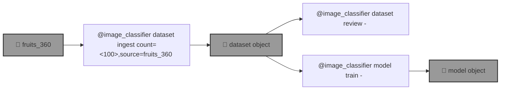

# 🪄 bluer-algo

🪄 `@algo` carries AI algo.  

```bash
pip install bluer-algo
```

items:::


```mermaid
graph LR
    image_classifier_dataset_ingest["@image_classifier dataset ingest count=<100>,source=fruits_360 <dataset-object-name>"]

    image_classifier_dataset_review["@image_classifier dataset review - <dataset-object-name>"]

    image_classifier_model_train["@image_classifier model train - <dataset-object-name> <model-object-name>"]

    fruits_360["🛜 fruits_360"]:::folder
    dataset_object["📂 dataset object"]:::folder
    model_object["📂 model object"]:::folder

    fruits_360 --> image_classifier_dataset_ingest
    image_classifier_dataset_ingest --> dataset_object

    dataset_object --> image_classifier_dataset_review

    dataset_object --> image_classifier_model_train
    image_classifier_model_train --> model_object

    classDef folder fill:#999,stroke:#333,stroke-width:2px;
```

---

> for the [Global South](https://github.com/kamangir/bluer-south).

---

signature:::